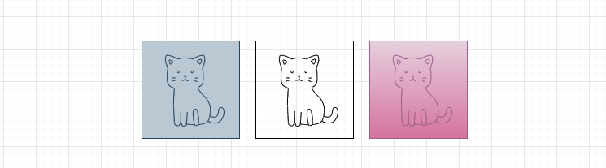
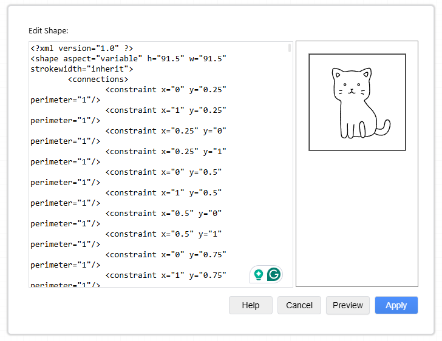

# SVG 2 MxGraph

This is a simple tool to convert SVG files to MxGraph XML files.

It is used to import vector graphics into [Draw.io](https://app.diagrams.net/) (which is based on MxGraph).

It allows to apply styles to the graphic, such as fill color, stroke color, stroke width, and opacity.



## Usage

1. Draw a vector graphic in a SVG editor (e.g. [Inkscape](https://inkscape.org/), or Adobe Illustrator).
2. Save the graphic as a SVG file.
3. Run the tool to convert the SVG file to a MxGraph XML file.

    ```bash
    python -m svg2mxgraph assets/cheese.svg
    ```

    which outputs the MxGraph XML to the console.

    ```xml
    <?xml version="1.0" ?>
    <shape aspect="variable" h="91.5" w="91.5" strokewidth="inherit">
            <connections>
                    <constraint x="0" y="0.25" perimeter="1"/>
                    <constraint x="1" y="0.25" perimeter="1"/>
                    <constraint x="0.25" y="0" perimeter="1"/>
                    <constraint x="0.25" y="1" perimeter="1"/>
                    <constraint x="0" y="0.5" perimeter="1"/>
                    <constraint x="1" y="0.5" perimeter="1"/>
                    <constraint x="0.5" y="0" perimeter="1"/>
                    <constraint x="0.5" y="1" perimeter="1"/>
                    <constraint x="0" y="0.75" perimeter="1"/>
                    <constraint x="1" y="0.75" perimeter="1"/>
                    <constraint x="0.75" y="0" perimeter="1"/>
                    <constraint x="0.75" y="1" perimeter="1"/>
            </connections>
            <background>
                    <rect x="0" y="0" w="91.5" h="91.5"/>
            </background>
            <foreground>
                    <fillstroke/>
                    <rect x=".5" y=".5" width="90.5" height="90.5"/>
                    <stroke/>
                    <path>
                            <move x="61.09" y="19.17"/>
                            <line x="30.4" y="19.17"/>
                            <line x="" y=""/>
                            <line x="" y=""/>
                            <line x="15.06" y="45.75"/>
                            <line x="30.4" y="72.32"/>
                            <line x="61.09" y="72.32"/>
                            <line x="76.44" y="45.75"/>
                            <line x="61.09" y="19.17"/>
                    </path>
                    <stroke/>
                    <path>
                            <move x="30.4" y="72.32"/>
                            <line x="61.09" y="19.17"/>
                    </path>
                    <stroke/>
                    <path>
                            <move x="76.44" y="45.75"/>
                            <line x="15.86" y="45.75"/>
                    </path>
                    <stroke/>
                    <path>
                            <move x="30.4" y="19.17"/>
                            <line x="61.09" y="72.32"/>
                    </path>
                    <stroke/>
            </foreground>
    </shape>
    ```

4. Copy the XML to the clipboard.
5. From Draw.io, go to `Arrange/Insert/Shape...`
6. Paste the XML into the `Edit Data` field.
7. Hit `Preview` to see the graphic.
8. Hit `Apply` to insert your chapess into the diagram.

    

## Limitations

- The tool does not support all SVG features.
- It is a proof of concept, and may not work with all SVG files.
- Feel free to contribute to the project.